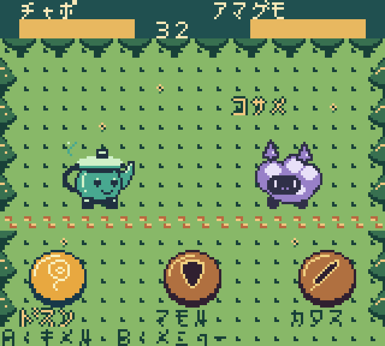

# オープンモンスター / Open Monster

[English](README.md) · [日本語](README.ja.md)

**みんなの創作が、誰かの相棒になる。**

コミュニティが生み出した自由で奇妙なモンスターを、自分の戦い方に育てる、Game Boy Color / ModRetro Chromatic 向けのオープンソースゲームです。

この版は育成と対戦、モンスター追加の仕組みを検証する小さな試作です。コード、ドット絵、独自のカタカナフォント、設定データの元データを公開しています。



## 遊ぶ

[ROMをダウンロード](https://github.com/tinjyuu/open-monster/raw/refs/heads/main/dist/open-monster.gbc)して、Game Boy Color対応エミュレーター、または対応する書き込み可能カートリッジで起動してください。Chromatic実機は**未検証**です。通常の市販カートリッジに自由に書き込めるとは限りません。

- **十字キー**：移動、メニュー選択。戦闘のカードは左右で選択。
- **A**：調べる、選択、技の決定。
- **B**：戻る。探索では仲間選択、戦闘では交代・スカウト・逃走。
- **START**：探索中にセーブ。
- **SELECT**：タイトル画面で日本語／英語を切り替え。STARTでクレジット案内。

相棒を選び、出発地点の建物の近くでAを押すと育成拠点に入れます。クンレンで技を習得したら、ワザノ クミカエで3つの技に装備してください。川は中央の道で渡れます。中央の草むらでは移動、またはAで野生のモンスターと出会えます。東側の3人の強者を倒すと試作の目標達成です。

日本語表示は8×8ピクセルの独自カタカナフォントです。画面に合わせた短い表記を使っています。

## 収録内容

- チャポ、アマグモ、トモリ、ネジマイ、カサモ、チクタクの6種。最初の3種から相棒を選択。
- 12種類の技、3つの訓練方針、最大6体の仲間、3人のCPUの強者。
- 同じ高さで向き合う戦闘画面、3枚の行動カード、相手の次の行動の予告。
- 防御は被ダメージ半減、回避は通常攻撃を避けるが連続使用不可。貫通攻撃は防御・回避を突破。
- 敗北時は仲間を失わず拠点に復帰。試作では戦闘開始時に全員が回復します。
- スカウトは相手の体力が少ないほど成功しやすくなります。同種の重複と7体目はスカウトできません。
- 勝利で経験値を獲得し、レベル上限は5。強者への再挑戦も可能です。

## プレイ動画

[約88秒のプレイ動画（MP4）](https://github.com/tinjyuu/open-monster/releases/download/v0.3.0/open-monster-gameplay-v0.3.mp4)。実際のROMをエミュレーターで操作した記録です。30fps、無音。再現する場合はFFmpegを用意し、`.tools/venv/bin/python scripts/record_gameplay.py` を実行します。

## ビルド

Python 3.12以降、make、公式[GBDK 4.5.0](https://github.com/gbdk-2020/gbdk-2020/releases/tag/4.5.0)を使用します。

```sh
python3 scripts/install_gbdk.py
make
```

手動でGBDKを配置する場合は `make GBDK_HOME=/path/to/gbdk`。成果物は `dist/open-monster.gbc`。64 KiB、GBC対応、MBC5 + RAM + battery、8 KiBのカートリッジRAMを宣言しています。

```sh
make test
python3 -m venv .tools/venv
.tools/venv/bin/pip install -r tests/requirements.txt
.tools/venv/bin/python tests/emulator_test.py
```

`make test` のネイティブ検証にはCコンパイラーも必要です。通常のROMビルドにPyBoy/Pillowは不要です。

## 参加する

アイデアだけでも歓迎です。[アイデア投稿](https://github.com/tinjyuu/open-monster/issues/new?template=monster-idea-ja.yml)から、性格・生態・戦い方を教えてください。ラフ、ドット絵、バランス調整、実装、テストを別々の人が担当できます。

[コントリビューション手順](CONTRIBUTING.ja.md)と[モンスターデータ仕様](docs/ja/monster-format.md)に、コードを変えずに1体追加する例があります。吉海と初期メンテナーが公開基準でレビューします。作者名は各JSONの `authors` と [CREDITS.md](CREDITS.md) に残します。

## セーブと検証状況

対応カートリッジのRAMに保存し、エミュレーターではそのカートリッジRAMファイルを使用します。非対応バージョン・破損データを検出した場合は、**その起動中の保存を禁止**して元データを保護します。保存せず新しい旅を試すことは可能です。アップデート前にRAMファイルをバックアップしてください。

[検証記録](docs/ja/verification.md)には実際の操作による完走テストと既知の制限を記録しています。エミュレーターでの成功とChromatic実機確認は別々に扱います。

## 多言語対応

ゲームは英語が標準で、タイトルのSELECTから日本語に切り替えられます。言語はセーブに保存します。名前・技・文章は `locales/en.json` / `ja.json` に分離し、文字数と翻訳漏れをCIで検査します。[翻訳の手順](docs/ja/localization.md)を参照してください。

## ライセンス

独自コード・設定・画像・フォントは [MIT](LICENSE)。GBDKのリンクされるライブラリはGPLv2 + linking exceptionです。[外部依存の説明](docs/third-party.md)を参照してください。

通信対戦、大規模な地方・物語、音楽、詳細な戦闘アニメーションは後続版の対象です。

描画元データと透過検査は[描画仕様](docs/ja/rendering.md)を参照してください。
