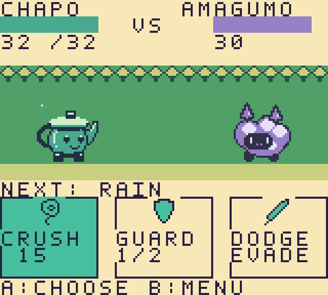

# Open Monster

[English](README.md) · [日本語](README.ja.md)

**Your creation. Someone's companion.**

An open-source monster-raising adventure for **Game Boy Color and ModRetro Chromatic**. Create strange original creatures together, train them your own way, and challenge the world's trainers.

This is a small, playable prototype: six species, twelve moves, scouting, training, three CPU challengers and battery-backed saves. Code, original pixel sources, font and content are open under MIT.



## Play

Download `open-monster.gbc` from [Releases](https://github.com/tinjyuu/open-monster/releases), then use a Game Boy Color emulator or a compatible writable cartridge. **Chromatic and original GBC hardware remain untested.** A regular commercial cartridge is not necessarily writable.

| Control | Action |
| --- | --- |
| D-pad | Move / choose; left and right select battle cards |
| A | Interact / confirm / use a move |
| B | Back; party in the field, auxiliary menu in battle |
| START | Save in the field; credits on the title screen |
| SELECT | Switch English / Japanese on the title screen |

Choose Chapo, Amagumo or Tomori as your first companion. Press A near the starting building to enter camp. Train a style, then **equip the learned move**. Cross the river on the central path, explore the grass, scout wild creatures, and defeat the three trainers to the east.

Battles show both companions at the same height and preview the opponent's next action. Guard halves damage. Dodge avoids ordinary attacks but cannot be used twice consecutively. Pierce bypasses both. Train attack, defense or skill to learn different moves; change your loadout freely at camp.

You can keep six different species. Battles start with a healed party; losing returns you to camp without losing companions. Levels currently stop at five.

## Gameplay video

[Watch the 88-second gameplay recording (MP4)](https://github.com/tinjyuu/open-monster/releases/download/v0.2.0/open-monster-gameplay-v0.2.mp4). Real emulator execution, button inputs only, 30 fps; the prototype has no audio. To reproduce it, install ffmpeg, build the ROM, install the test dependencies, then run `.tools/venv/bin/python scripts/record_gameplay.py`.

## Build and verify

Use Python 3.12+, make and [GBDK 4.5.0](https://github.com/gbdk-2020/gbdk-2020/releases/tag/4.5.0).

```sh
python3 scripts/install_gbdk.py
make
make test
```

For an existing toolchain: `make GBDK_HOME=/path/to/gbdk`. `make test` also requires a native C compiler. The ROM is 64 KiB, GBC compatible, MBC5 + RAM + battery, with 8 KiB cartridge RAM.

```sh
python3 -m venv .tools/venv
.tools/venv/bin/pip install -r tests/requirements.txt
.tools/venv/bin/python tests/emulator_test.py
OPEN_MONSTER_LOCALE=ja .tools/venv/bin/python tests/emulator_test.py
.tools/venv/bin/python tests/addition_test.py
```

CI builds the ROM, checks data and translations, runs both languages through the adventure, and verifies an additional JSON-only species. See [verification](docs/verification.md).

## Create with us

**An idea is enough to join.** Propose a creature's personality, habitat and fighting style through [Issues](https://github.com/tinjyuu/open-monster/issues/new/choose). Different people can help with artwork, writing, balance, code and testing.

Read [Contributing](CONTRIBUTING.md) and the [monster format](docs/monster-format.md). Ordinary species additions require content and pixel data, not changes to the game engine. Creators are credited in the monster's `authors` field and [CREDITS](CREDITS.md). tinjyuu and the initial maintainers review proposals against public criteria.

## Languages

English is the repository's entry point; Japanese documentation is linked beside it. The game has **runtime English/Japanese switching**, including menus, messages, species names, descriptions and moves. The selection is saved, and v0.1 save files still load as Japanese.

- `locales/en.json` / `ja.json`: stable semantic keys, plain flat JSON.
- `locales/context.json`: translator context and maximum display cells.
- `python3 scripts/check_locales.py`: missing/extra keys, empty values, glyphs and text overflow.

This layout is compatible with Weblate's JSON format. No external translation account or synchronization is enabled automatically. See [Localization](docs/localization.md) to contribute or configure a translation service.

## Saves, roadmap and license

Unsupported or damaged saves are protected: the game allows a fresh unsaved journey but blocks writes to that cartridge's RAM. Back up your RAM file before upgrades.

The prototype has no music, detailed battle animations, duplicate-species raising, storage boxes, multiplayer or full campaign yet. Additional languages need supported fonts and a ROM budget review.

Original code, setting data, pixels and font: [MIT](LICENSE). Linked GBDK library: GPLv2 with linking exception. [Dependency notices](docs/third-party.md).
